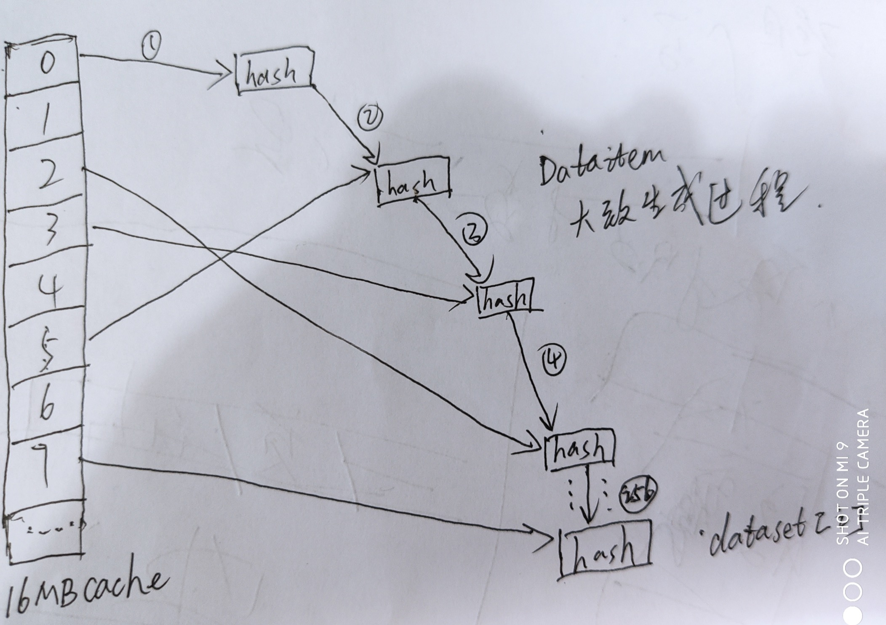

# 2020-06-30

- ProgPow 程序化工作量证明过程
- 每3w个块为一个周期 epoch
- 值大小换算 2^24 = 16M 2^17 128kb 2^30 1GB 2^23 8M
- 随着周期增长 前2048个epoch 读取配置，即6000多w块 缓存大小也以线性方式增长 y = 2^24 + epoch * 2^17 - 64 ，
- 因为根据缓存大小 要生成n组64 bytes keccak512 hash值,n = y / 64, ，因为cache值是计算的初始最重要的数据
- 为保持n组hash值无数学上特殊规律，所以n 向下取 最大的素数。
- 即 y / 64 要是素数 如果不是 则继续减少y值大小 y -=2*64 直到 y/64 是素数为止
- seed 32 bytes 生成规则 按epoch大小 循环生成n次 keccak256 hash 如果epoch 为0 则返回 zeroHash
- n组 cache[n] 缓存大小y 生成规则 第一组hash cache[0] 是keccak512(seed) 第二组是keccak512(cache[0])
- 以此类推 第n组 n >= 2 cache[n-1] = keccak512(cache[n-2])
- 对cache 进行3轮重新赋值运算，每轮取两组hash(一组是按顺序取，一组随机取)进行异或运算再重新赋hash值，以保证cache值结果随机以及无任何规律(一般hash运算常见步骤)
- 根据epoch生成 dataset数据集 线性增长 前6000w块 取配置 y1 = 2^30 + 2^23 * epoch - 128 和cache size生成类似
- 同理 y1/64 也是素数n 不是就减少y1值 生成n组 64 bytes keccak512 hash值  dataset[n]
- n组 dataset 生成规则 需要 参数 cache 和 索引n
- 每个dataset[n] generateDataItem过程
    - cache 转换成 y / 4 组uint32 数
    - 根据索引n取 cache中16组 uint32 16*4 = 64 合并组成新的hash
    - 新的hash 转换 16个 4字节uint32 再进行256次 与cache中uint32 两两异或 最终生成新的hash
    - 此过程的关联生成 运用DAG方式生成
- cDag 16 kb数据 生成规则

    - 根据generateDataItem 生成256组hash
    - 每组hash 可拆分16 组uint32
    - 即cDag 存储 16 * 256 = 4096 组uint32 共16kb数据

- hashimotohash

    - hashimoto hash 需要nonce 8字节 32字节headerhash 当前数据集dataset大小 dataset可有可临时按index生成
    - nonce追加到headerhash 构成40字节 seed
    - 对seed进行keccak512 hash 64字节
    - mix 128字节 前64字节为seedhash
    - seed 前4个字节作为key 进行64次 随机hash 获取dataset中的hash值进行两两hash 赋值给mix 在不断异或 保持随机
    - 对mix取前32字节作为digest 作为一系列操作的摘要
    - 最终result hash 则是seed+digest 进行keccak256 hash  再与target 进行比较

- propowhash

    - 需要nonce 32字节headerhash 当前数据集dataset大小 16kb cDag数据 dataset数据可有可临时按index生成 blockNumber
    - 将 header hash 和 nonce  进行keccakF800Short 得出一个8字节 uint64 seed
    - mix 由16组32字节hash组成
    - 利用seed 填充 mix的16组hash
    - 进行64组计算，每组进行 progpowLoop 计算 需要 当前period = blockNumber / 10 ,mix, cDag, dataset
    - progpowLoop 生成过程
        - dag_item 由4组 64字节hash组成
        - 4组hash 由mix[0] 决定取dataset中某4组hash
        - 进行16组的随机运算 对mix 进行重新赋值运算
        - 前11组运算中 从cdag中取数据参与运算
        - data_g为4组uint32
        - 每组uint32 将从dag_item中取得
        - 将mix 与dag_item 进行合并运算 重新赋值mix
    - 将mix进行内部运算成一个64bytes hash
    - 再将 64bytes hash 转换32字节hash
    - result hash 为 keccakF800Long hash 参数 headerhash nonce 以上的32字节hash
    
    
# Ethash Miner Hashrate (mHash/s) [ETH]

| miner	| 1070ti	| 1070	| 1060	| 
| ---| --- | --- | --- | 
| claymore_15	|21.26	|20.62	| 19.38 | 
| gminer1.99	| 21	| 20.50	| 19.33 | 
| hspminer_2.09	| 20.98	| 20.16	| 19.19 |
| nbminer31.1	| 21.12	| 20.58	| 19.42 |
| ethminer(latest)	| 20.72	| 20.04	| 19.22 |
    
# KawPow Miner Hashrate (mHash/s) [RVN]

| miner	| 1070ti	| 1070	| 1060	| 
| ---| --- | --- | --- | 
| nbminer31.1	| 13.34	| 13.01	| 9.86 |
| rex_0.15.7_cuda10.0	| 13.35	| 13.30	| 9.97 |
| enemy_2.6.1_cuda9.2	| 13.36	| 13.15	| 9.75 |
| gminer2.11	| 13.30	| 13.20	| 9.50 |

# Ethash GPU Utilization  [1070ti]

| 指标	| nbminer31.1	| gminer_2.09	|
| ---| --- | --- | 
|功率| 119w/180w | 119w/180w | 
|显存占用| 4065M/8192M | 4067M/8192M | 
|GPU利用率| 100% | 100% | 
|风扇转速| 37% | 36% | 
|温度| 64摄氏度 | 64摄氏度 | 

# KawPow GPU Utilization  [1070ti]

| 指标	| nbminer31.1	| gminer_2.11	|
| ---| --- | --- | 
|功率| 177w/180w | 179w/180w | 
|显存占用| 2667M/8192M | 2669M/8192M | 
|GPU利用率| 100% | 100% | 
|风扇转速| 49% | 48% | 
|温度| 72摄氏度 | 72摄氏度 | 

### 使用cuda自带命令行监控看
    - 从对比看KawPow对显卡功率的提升是显著，几乎用满，几乎用完显卡能力
    - 显存占用两边可以 不用对比，因为和DAG和高度有关
    - GPU利用率提升看不出来，之前也是100%满的
    - 也就是功率应该就是文章所指sm值
    
# ProgPow 可调参数点

 - 1 ETHASH_DATASET_PARENTS 256 -> 512
   - 此参数为dag里每条数据生成规则，主要消耗生成时长
   - 256 即表示dataset中每个hash需要生成256个动态节点关联生成一个hash
   - 512 即表示每个hash需要生成512个动态节点关联生成一个hash
   - 导致每个hash生成时间拉长

    
 - 2 PROGPOW_PERIOD: 50 -> 10
    - 此参数是progpow 最后hash里 随机函数需要用到的 种子 调整周期
    - 即每50个高度改变一次种子
    - 现在每10个高度改变一次种子 加快变化周期
    - 一方面种子一变影响hash结果
    - 另一方面此随机函数不能像keccak一样在硬件中写死,当然也可以写，但是得传动态变量高度参数计算
    
 - 3 PROGPOW_CNT_CACHE: 12 -> 11
    - 在计算hash轮次时随机读取临时内存的次数
    - progpow 缓存了16kb cdag dataset数据到临时内存中
    - 此参数将决定在hash计算时随机从内存中读取次数
    - 12 到 11 减少了一次的读取
    
 - 4 PROGPOW_CNT_MATH: 20 -> 18
    - 此参数决定hash过程中随机函数调用次数和随机读取cdag 内存次数
    - 这个降低也将大幅降低 cdag的读取次数
    
  - 5 3 - 4 参数的微调主要想要匹配硬件的计算利用率(sm) 与GPU内存利用率 达到最高
    - 个人认为此项不一定通用所有gpu设备，可能当时调试的设备达到最佳，不一定所有设备能达到最佳

# 使用progpow 编译版 与ethminer 比对

### 测试环境 
- 系统：Windows 10 
- cuda：10.1
- VC++ Runtime 2019 
- 显卡：1060 1070 1070ti
- 编译命令
```bash
$ cd repo
$ mkdir build && cd build
$ # 编译需要安装visual stadio 2017 或者 2019
$ cmake .. -G "Visual Stadio 15 2017 Win64"
$ cmake .. -G "Visual Stadio 16 2019"
$ cmake --build . --config Release 
$ TODO 此为动态编译需要测试环境 拥有以上软件环境 需要研究静态编译
```
- 测试命令
```bash
$ ./progpowminer -U -M 100
$ ./ethminer -U -M 100
```
- 参数说明 
    - `U` cuda 
    - `G` opencl
    - `M` 测试使用多少高度，此高度决定使用DAG大小，即使用显存大小,每3w块为1 epoch 初始在1G左右
- 测试结果 对比结果

| 指标	| progpow	| ethash	|
| ---| --- | --- | 
|三卡算力总和| 35.7 (mHash/s) | 73.79 (mHash/s) | 
|功率(1070ti)| 180w/180w | 131w/180w | 
|显存占用(1070ti)| 1259M/8192M | 1259M/8192M | 
|GPU利用率(1070ti)| 100% | 100% | 
|风扇转速(1070ti)| 40% | 20% | 
|温度(1070ti)| 68C | 60C | 